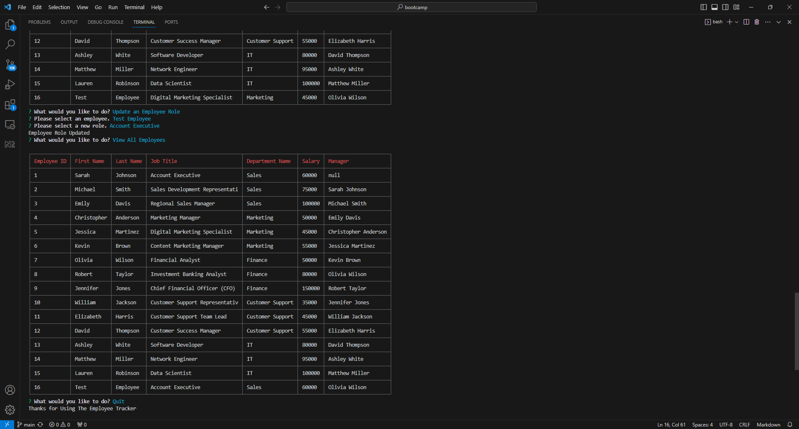

# Mod-12-Employee-Tracker

## Description

A node.js application that tracks employee data, their role, and department. It stores this information in a MySQL database and is written for the command line interface. 

## Installation

Project has a dependencies the user must run npm install to include the needed libraries.  Additionally, node.js must be installed.

## Usage

Run npm start from the installed folder. 

Sample usage video link: [Here](https://youtu.be/UlOmAo1L_mc)

The following image shows the application's appearance and functionality:

## Credits

N/A

## License

N/A
